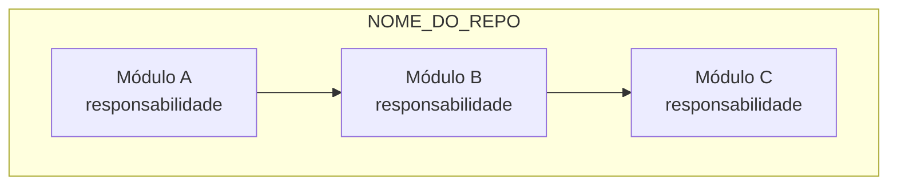
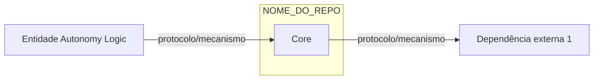

# CLAUDE.md

This file provides guidance to Claude Code (claude.ai/code) when working with code in this repository.

## Build & Development Commands

```bash
# Install dependencies
npm install

# Development mode (hot reload for both main and renderer)
npm run start:dev

# Build for production
npm run build

# Build individual processes
npm run build:main      # Electron main process
npm run build:renderer  # React renderer process
npm run build:dll       # Webpack DLL for faster dev builds

# Package for distribution
npm run package

# Linting and formatting
npm run lint            # ESLint check
npm run lint:fix        # Auto-fix lint issues
npm run format          # Prettier formatting

# Testing
npm run test            # Jest with coverage
npm run test:unit       # Jest watch mode
npm run test:e2e        # Playwright E2E tests

# Native module rebuild (after node version changes)
npm run rebuild
```

## Architecture Overview

This is an Electron + React application for PLC (Programmable Logic Controller) programming using IEC 61131-3 standards.

### Process Architecture

```
Main Process (Node.js)           Renderer Process (React)
├── src/main/main.ts             ├── src/renderer/index.tsx
├── modules/                     ├── components/
│   ├── compiler/                ├── screens/
│   ├── ipc/                     │   ├── StartScreen/
│   ├── modbus/                  │   └── WorkspaceScreen/
│   ├── preload/                 ├── store/ (Zustand slices)
│   └── websocket/               └── hooks/
├── services/
│   ├── project-service/
│   ├── pou-service/
│   └── user-service/
```

### IPC Communication

Communication between main and renderer uses typed IPC bridges:
- **Main bridge:** `src/main/modules/ipc/main.ts` - Handler definitions
- **Renderer bridge:** `src/main/modules/ipc/renderer.ts` - Invocation wrappers
- **Preload:** `src/main/modules/preload/preload.ts` - Exposes `window.bridge`

### State Management

Zustand store with 14 domain slices in `src/renderer/store/slices/`:
- `WorkspaceSlice`, `EditorSlice`, `TabsSlice` - UI state
- `FBDFlowSlice`, `LadderFlowSlice` - Visual programming editors
- `ProjectSlice`, `FileSlice`, `DeviceSlice` - Project data
- `ConsoleSlice`, `ModalSlice`, `SearchSlice` - Utilities

### PLC Compilation Pipeline

The `CompilerModule` (`src/main/modules/compiler/`) orchestrates:
1. IEC 61131-3 XML parsing
2. Device/pin configuration generation
3. C/C++ code generation via `xml2st` and `iec2c` binaries
4. Arduino CLI integration for embedded targets
5. Modbus TCP/RTU configuration

Platform-specific binaries in `/resources/bin/[platform]/[arch]/`.

### Key Path Aliases (tsconfig.json)

```
@root/*           → ./src/*
@process:main/*   → ./src/main/*
@process:renderer/* → ./src/renderer/*
@components/*     → ./src/renderer/components/*
@utils/*          → ./src/utils/*
@shared/*         → ./src/shared/*
@hooks/*          → ./src/renderer/hooks/*
```

## Testing

- **Unit tests:** Jest with jsdom environment, test files use `*.test.ts(x)` or `*.spec.ts(x)`
- **E2E tests:** Playwright in `/e2e` directory, Chromium only
- **Mocks:** `configs/mocks/` for file stubs, `identity-obj-proxy` for CSS modules

## Code Style

- This is a TypeScript-first codebase. Use strict TypeScript patterns, proper typing, and avoid `any` types.
- ESLint flat config (`eslint.config.mjs`) with TypeScript strict type checking
- Prettier: 120 char width, no semicolons, single quotes, trailing commas
- Import sorting enforced via `simple-import-sort` plugin
- Pre-commit hooks via Husky run lint-staged on `./src/**/*`

## Key Technologies

- **Electron 35** / **React 18** / **TypeScript 5.4**
- **Monaco Editor** for code editing (Python LSP support)
- **Tailwind CSS** + **Radix UI** for styling
- **DND Kit** for drag-and-drop in visual editors
- **Socket.io** for real-time communication
- **Modbus TCP/RTU** clients for industrial protocols

## Debugging

- When fixing UI flickering or rendering issues, always check for multiple potential causes: component re-renders, data changes, AND layout/sizing recalculations. Test fixes with the specific user-reported conditions (e.g., specific chart sizes, time ranges) before marking complete.
- For multi-step debugging tasks, verify each fix is working before moving to the next issue. Run the app and confirm the specific behavior is resolved.

## Environment Requirements

- Node.js >= 20.x < 24
- npm >= 10.x
- Supported platforms: macOS, Windows, Linux (x64 & ARM64)

# Architecture Survey — Autonomy Logic

## Objetivo
Levantar a arquitetura deste repositório para documentação interna da equipe.
Ao receber o comando `/survey`, execute as tarefas abaixo **sem modificar nenhum arquivo de código**.

---

## Instruções para o Claude Code (`/survey`)

### 1. Identidade do projeto
- Nome e propósito principal do repositório
- Linguagem(ns) predominante(s) e versões relevantes (ex: C99, Python 3.11, Node 18)
- Sistema alvo (ex: Linux PREEMPT_RT, Raspberry Pi 5, browser, servidor)

### 2. Estrutura de módulos
- Liste os diretórios/pacotes principais e a responsabilidade de cada um
- Identifique o ponto de entrada da aplicação (main, entrypoint, init)
- Identifique módulos de negócio vs. infraestrutura vs. utilitários

### 3. Interfaces e APIs expostas
- APIs HTTP/REST/gRPC: endpoints, métodos, contratos (se houver spec OpenAPI/Protobuf, aponte o caminho)
- Sockets / IPC / pipes: protocolos usados
- Shared memory ou mmap: estruturas compartilhadas
- Bibliotecas exportadas: headers públicos ou módulos exportados

### 4. Interfaces consumidas (dependências externas)
- Bibliotecas de sistema (ex: libethercat, libpthread, libc)
- Serviços externos (ex: MQTT broker, banco de dados, APIs REST de terceiros)
- Hardware diretamente controlado (ex: NIC para EtherCAT, GPIO)
- Dependências de outros repositórios da Autonomy Logic

### 5. Fluxo de dados principal
- Descreva o caminho dos dados do ponto de entrada até a saída principal
- Identifique dados em tempo real (ciclos, streams) vs. dados de configuração/parametrização
- Indique buffers, filas ou mecanismos de sincronização relevantes

### 6. Dependências entre entidades internas da Autonomy Logic
- Este repo chama ou é chamado por: runtime / orchestrator / autonomyedge / editor?
- Qual o protocolo/mecanismo de comunicação entre eles?

---

## Formato de saída esperado

Produza um arquivo `ARCHITECTURE_SURVEY.md` na raiz do repositório com as seções acima preenchidas, seguido de dois diagramas Mermaid:

### Diagrama 1 — Estrutura interna (módulos)


### Diagrama 2 — Interfaces externas


---

## Regras
- Não modifique arquivos de código-fonte
- Se não conseguir inferir algo com certeza, marque com `[INFERIDO]` ou `[VERIFICAR]`
- Prefira nomes reais encontrados no código (funções, structs, classes, arquivos)
- Se existir README, Makefile, CMakeLists.txt, package.json ou pyproject.toml, leia-os primeiro
