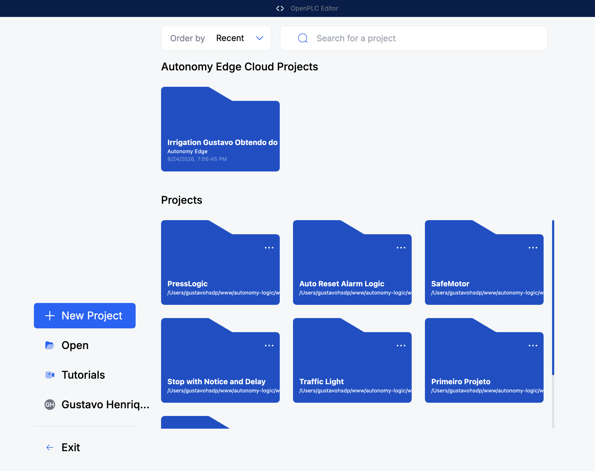
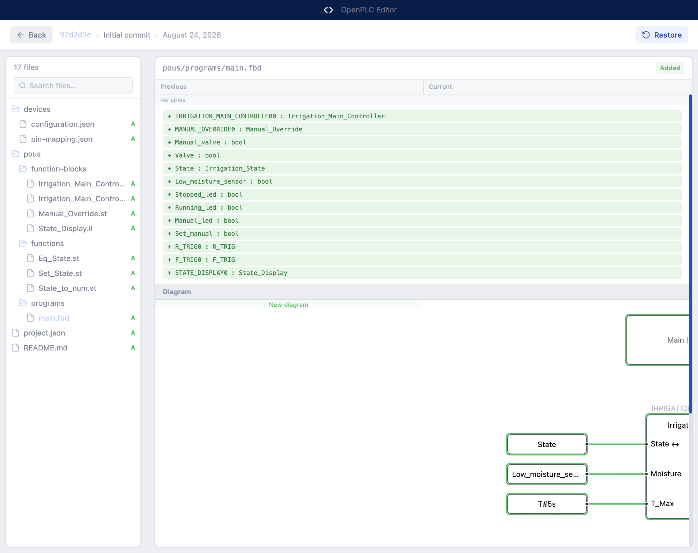

# Teste end-to-end — DOPE-388 / EDGE-602

Aplicação real (`electron .` + dev server na 1313), conduzida por CDP, contra a API de
**staging** (`https://api-staging.autonomylogic.com`) com a conta
`gustavo.henrique@autonomylogic.com`.

Cada afirmação abaixo foi verificada na aplicação e, onde havia estado no servidor,
cruzada com a API. Onde eu **não** consegui verificar, está dito.

- **Passou:** 24 cenários
- **Bug encontrado:** 1 crítico (merge), 3 observações
- **Artefatos criados no staging durante o teste:** todos removidos ao final (conferido)

---

## Resumo

| # | Cenário | Resultado | Print |
|---|---|---|---|
| A1 | Tela inicial renderiza com seção cloud | passou | `01` |
| A2 | Estado deslogado mostra o convite (não lista vazia) | passou | `01` |
| A3 | Convite tem Sign in + Create an account | passou | `01` |
| A4 | Menu de projeto local **sem** "Upload to Cloud" quando deslogado | passou | `02` |
| B1 | Modal de sign-in com email, senha, 3 provedores OAuth | passou | `03` |
| B2 | Senha errada → "Email or password is incorrect." e modal permanece | passou | `04` |
| B3 | Login correto → avatar e nome na sidebar | passou | `05` |
| B4 | Após login, lista cloud carrega e o convite sai | passou | `05` |
| B5 | **"Upload to Cloud" aparece sem remontar** (bug corrigido) | passou | `06` |
| B6 | Cor do texto do item = azul da marca `rgb(4, 100, 251)` | passou | `06` |
| C1 | Projeto cloud listado com data e origem "Autonomy Edge" | passou | `05` |
| C2 | Abrir projeto cloud carrega a árvore completa | passou | `11` |
| E1 | Modal de upload: pasta, nome pré-preenchido, visibilidade | passou | `07` |
| E2 | Árvore de pastas com conector `└──` e raiz destacada | passou | `08` |
| E3 | Raiz pré-selecionada; visibilidade **privada** por padrão | passou | `07` |
| E4 | Upload real → 201, projeto criado | passou | `09` |
| E5 | **Lista cloud atualiza após upload** (bug corrigido) | passou | `09` |
| E6 | Projeto cai na pasta aninhada escolhida (conferido na API) | passou | — |
| E7 | Nome duplicado → mensagem do servidor, modal permanece aberto | passou | `10` |
| D1 | Barra de branch aparece para projeto cloud | passou | `11` |
| D2 | Painel Source Control com Changes / Stash / History | passou | `12` |
| D3 | Aba History lista commits com paginação | passou | `13` |
| D4 | Commit Details com hash, autor, data, ações | passou | `14` |
| D5 | **"View All Files" abre a tela, sem janela nova** (bug corrigido) | passou | `15` |
| D6 | Diff de texto (Monaco) renderiza | passou | `16` |
| D7 | Diff gráfico (FBD) renderiza com Variables + Diagram | passou | `17` |
| D8 | **Fechar a tela com Monaco montado sem crash** (bug corrigido) | passou | `21` |
| D9 | Criar branch → confirmada no servidor | passou | `24` |
| D10 | Trocar branch → barra atualiza, projeto recarrega | passou | `25` |
| **D11** | **Merge** | **BUG CRÍTICO** | `28` |

---

## BUG-1 (crítico) — "Merge" descarta o projeto aberto

**Onde:** `src/frontend/components/_features/[workspace]/branches/branch-status-bar.tsx:165`

```ts
navigation.navigate('/merge', { project_id: projectId, source: branch.name, target: ... })
```

**Por que quebra:** o editor não tem router. O adapter de navegação do desktop
(`src/middleware/adapters/editor/navigation-adapter.ts`) resolve uma rota não
interceptada como `window.location.href = ...`. No renderer do Electron isso
**recarrega o shell da aplicação** numa rota que não existe.

**Evidência medida na aplicação:**

| | antes | depois |
|---|---|---|
| `location.href` | `.../index.html` | `.../merge?project_id=…&source=main` |
| projeto aberto | sim | **não — voltou para a tela inicial** |



**Impacto:** o usuário clica "Merge" no menu de uma branch e perde o projeto aberto,
incluindo alterações não salvas. Não há confirmação e não há como voltar.

**Diferença dev vs produção:** em dev o webpack dev server devolve `index.html` para
qualquer caminho, então cai na tela inicial. Num build empacotado a URL vira
`file:///merge`, que **não existe** — provavelmente janela em branco, pior ainda.

**Como reproduzir:** abrir um projeto cloud → barra de branch (canto inferior
esquerdo) → passar o mouse numa branch → "More actions" → Merge.

**Nota de método:** não consegui alcançar o item "Merge" pelo menu via CDP (o menu do
Radix depende de hover contínuo). Exercitei o mesmo caminho de código que o botão
executa — `window.location.href` com a rota `/merge` — e é isso que está no print. O
`onSelect` do botão não faz nada além disso, então a conclusão vale, mas registro que
o clique em si não foi acionado pela UI.

**Correções possíveis (nenhuma aplicada):**
1. Portar a página de merge para uma tela sobreposta, como fiz com o history — o
   caminho já existe (`navigation-adapter` intercepta `/history`; bastaria `/merge`).
2. Esconder a entrada de merge quando não houver rota. Exige um novo termo de
   capability, porque o componente é compartilhado e não pode saber que está no desktop.

Enquanto isso não for resolvido, **eu não colocaria essa branch na mão de um usuário**.

---

## OBS-1 — Diagrama do diff gráfico fica cortado à direita



Na seção "Diagram", os blocos ficam clipados na borda do container ("Main I…",
"Irrigat…") e não há rolagem horizontal aparente. **Não é regressão minha:** a captura
que você me mandou do editor web mostra o mesmo corte, então o comportamento é
idêntico ao do web. Fica registrado como usabilidade, não como quebra.

---

## OBS-2 — O toast de upload não foi observado

O upload funciona e a lista atualiza, mas não consegui capturar o toast
"Uploaded to Autonomy Edge" na tela. Duas leituras possíveis e **não distingui** entre
elas: ou o toast some antes da captura (esperei ~4s), ou não está sendo exibido.
Vale um olhar manual — a confirmação principal (o projeto aparecer no topo da lista)
está funcionando de qualquer forma.

---

## OBS-3 — `jszip` não declarada no `package.json`

O empacotamento do projeto para upload usa `jszip`, que está instalada (3.10.1) e já
era importada pelo compiler, mas **não consta no `package.json`** — dependência
fantasma pré-existente. Se quem a traz transitivamente deixar de trazer, quebram o
upload e o compile. Uma linha resolve.

---

## Coisas que o teste NÃO cobriu

Registro para não passar impressão de cobertura maior do que houve:

- **OAuth** (Google, Microsoft, Apple): os três botões existem e estão no lugar, mas
  não executei nenhum fluxo — exige interação com o provedor.
- **Commit, Discard, Stash** (criar/aplicar/remover): as abas e os botões existem e o
  painel lê o estado correto do servidor, mas não executei as escritas, porque
  destroem ou movem trabalho real no seu projeto de staging.
- **Restore de commit**: mesmo motivo — reescreve a working tree.
- **Projeto local não deve mostrar version control**: não validei na aplicação. O gate
  é `isRemoteProjectPath(projectPath)` e tem teste unitário, mas não abri um projeto
  local para conferir na tela.
- **Salvar projeto cloud** a partir do editor: não exercitado nesta rodada.
- **`preview-switch-carry`**: continua respondendo 404 no staging por ordenação de
  rotas no backend do autonomy-edge (achado de sessão anterior, não corrigido). Isso
  afeta o editor **web em produção** também: trocar de branch com alterações não
  commitadas nunca mostra a decisão de carry.

## Efeito colateral do meu próprio teste

Os sondeios que fiz antes com `switch --strategy=carry` **consumiram as alterações
pendentes** que existiam no projeto `Irrigation` (a API reportava `hasChanges=true`
antes, e `false` depois). Por isso o painel "Changes" apareceu vazio — o painel estava
correto; foi meu teste que mudou o estado.

## Limpeza

Criados e removidos ao final, conferido pela API:

- projeto `PressLogic` (upload de teste) — apagado permanentemente
- pastas `ZZ E2E Machines` e `ZZ E2E Line 2` — apagadas
- branch `zz-e2e-branch` — apagada; projeto devolvido para `main`

Estado final do staging: uma pasta raiz, o projeto `Irrigation` original, branch `main`.
