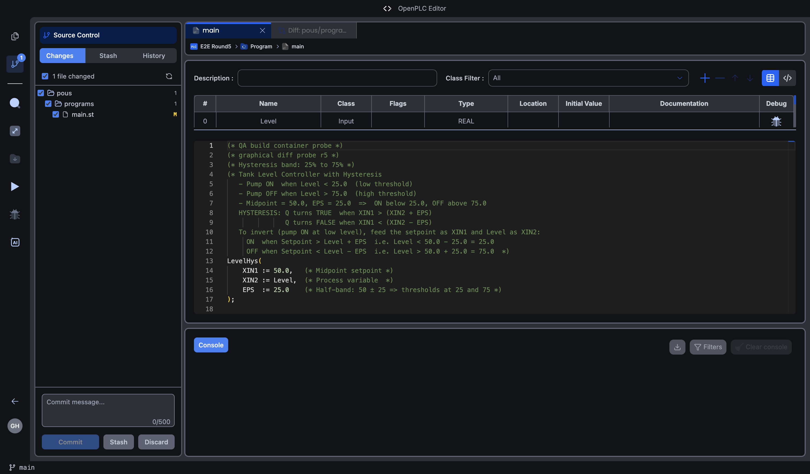
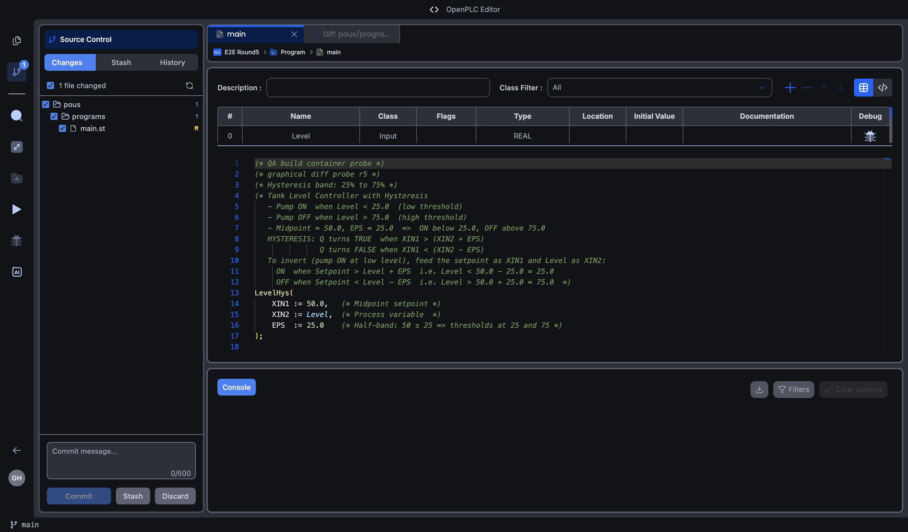

# One Monaco editor restyling every other one

Why opening a diff killed the syntax highlighting in the POU editor behind it,
and why the fix is in four places rather than one.

Found on 2026-09-17, reported by a user against
openplc-editor#1056 / openplc-web#711, reproduced and fixed against
`api-staging.autonomylogic.com`.

---

## 1. The defect

`monaco.editor.setTheme()` is **global**. It is a property of the Monaco
namespace, not of an editor instance, so whatever the last mounted editor asked
for applies to every editor on the page.

The app defines its own themes, `openplc-light` and `openplc-dark`, which is what
carries ST highlighting: the `HYSTERESIS` block call in gold, `Level` in blue
italic, the comment colour. The diff viewer asked for Monaco's built-ins instead:

```tsx
// file-diff-view.tsx, before
theme={isDark ? 'vs-dark' : 'vs'}
```

Mounting a diff therefore replaced the app's theme everywhere. The POU editor
behind it kept rendering, but with `vs-dark`'s token colours, which have no rule
for the ST tokens — so the function block name and the variable references fell
back to plain foreground.

**And it did not recover.** The POU editor's theme effect depends only on
`[shouldUseDarkMode]`, which had not changed, so nothing re-asserted the theme
when the user came back to the tab. The only way out was toggling dark mode by
hand, which is exactly the workaround the report described.

### Reachable path

Open a textual POU → Source Control → click a changed file. Both entry points
into the diff viewer do it: the Changes panel (`diff-viewer/index.tsx`) and the
commit-history file browser (`commit-history/index.tsx:458`).

---

## 2. Reproduced, measured

Driving the built app rather than reading the code, on a cold build, signed in to
staging, cloud project `E2E Round5`, POU `main` (18 lines of ST), in dark mode.
The measurement counts distinct computed colours among the POU editor's own
tokens, excluding any mounted diff editor, and samples the `LevelHys` token.

| | distinct colours | `LevelHys` |
|---|---|---|
| POU open, no diff yet | 7 | `rgb(220, 220, 170)` — gold |
| after opening a diff and returning to the tab | **5** | **`rgb(212, 212, 212)`** — plain foreground |

The comment colour moved too, `rgb(106, 153, 85)` → `rgb(96, 139, 78)`: that is
`openplc-dark`'s green being replaced by `vs-dark`'s. It is the clearest proof
that the whole theme was swapped rather than one rule being lost.



Line 13 `LevelHys` and line 15 `Level` have lost their colours.

---

## 3. The fix

### 3.1 Every diff asks for the app's theme

Four call sites, all of them the same one-line change plus registering the themes
on mount:

```tsx
theme={isDark ? 'openplc-dark' : 'openplc-light'}
beforeMount={ensureOpenplcThemes}
```

`ensureOpenplcThemes` is needed because a diff can be the **first** Monaco on the
page — open a diff before any POU and the `openplc-*` themes would not exist yet.
It is idempotent, latched on a `WeakSet` keyed by the Monaco instance, so the
repeat calls cost nothing.

| File | Sites |
|---|---|
| `editor/diff-viewer/file-diff-view.tsx` | 1 |
| `branches/merge-text-conflict-resolver.tsx` | 2 (DiffEditor and Editor) |
| `branches/branch-merge-view.tsx` | 1 |

**Provenance.** `file-diff-view.tsx` predates this PR, on `development`. The
other two files are new in this PR and replicated the pattern from it. So the
defect is older than the branch, and the branch widened it.

### 3.2 The POU editor re-asserts its own theme

```tsx
// monaco/index.tsx
useEffect(() => {
  if (!isActive) return
  const monacoInstance = monacoRef.current
  if (!monacoInstance) return
  applyThemeNow(monacoInstance, shouldUseDarkMode)
}, [isActive, shouldUseDarkMode])
```

This is not redundancy for its own sake. §3.1 fixes the four editors we know
about; this makes the POU editor recover from **any** future editor that sets a
theme, and the cost is one `setTheme` call when a tab becomes active.

It was verified to work on its own — see §4, stage A.

---

## 4. Verification

Run from a full cold start: every `electronmon`, Electron and `webpack serve`
process killed, `configs/dll` and `node_modules/.cache` deleted, the Electron
`Cache`, `Code Cache` and `GPUCache` cleared, then DLL and main bundles rebuilt
and the served renderer bundle checked for the fix.

Three stages on that one build, switching the source and reloading between them,
so the only variable is the fix.

| Stage | `file-diff-view` | safeguard | POU alone | after the diff |
|---|---|---|---|---|
| **A** | reverted to `vs` | present | 7 · gold | **7 · gold** |
| **B** | reverted to `vs` | removed | 7 · gold | **5 · plain** |
| **C** | fixed | present | 7 · gold | **7 · gold** |

Stage B is the bug, reproduced on the fixed build by taking the fix back out.
Stage A shows the safeguard alone is sufficient, which is why it is worth having.
Stage C is what ships.



Also checked, with the fix in place:

- **Light mode**, the same project and POU: 6 distinct colours and
  `LevelHys` = `rgb(121, 94, 38)`, identical before and after the diff.
- **Alternating** the POU and diff tabs three times: unchanged each cycle.
- **The commit-history diff** (History → a commit → View All Files → `main.st`),
  the other `FileDiffView` entry point: unchanged after returning to the POU.
- **The diff itself** now renders in the app's theme rather than Monaco's
  default, which was a visible inconsistency of its own.

The `merge-text-conflict-resolver` and `branch-merge-view` sites were not driven
through the UI — reaching them needs a real merge conflict on a cloud branch.
They take the identical one-line change as the site that was driven, and the unit
test below covers the rule they follow.

### Gates

| Gate | Result |
|---|---|
| jest (editor) | 454 suites, 9,477 tests, 2 skipped suites |
| vitest (web), mirrored files | 17 tests |
| `tsc --noEmit`, both repos | clean |
| ESLint | no new warnings (10 + 3 on the two touched files, before and after) |
| `validate:arch` | clean |
| `compare-surfaces.py` | `total_diffs: 0` |

### The test

`file-diff-view.test.tsx` gained a `describe('the theme it drives')` with two
cases: the diff never applies `vs` or `vs-dark`, and it applies `openplc-light`.
The fake Monaco records every `setTheme`.

A third case, asserting the diff *defines* the themes, was written and then
dropped: `ensureOpenplcThemes` latches per instance and the file shares one fake
Monaco across its tests, so the assertion only held when it happened to run
first. A test that depends on its position in the file proves nothing.

Writing it did surface something real, though. Removing `defineTheme` from the
fake made the suite fail with `vs` being applied — that is `theme-utils`'
`catch` block, which falls back to a built-in theme when defining fails. It is
the one remaining path that can still set a global built-in theme, and it is
correct: if the app's themes cannot be defined, a built-in is better than none.

---

## 5. Files changed

| File | Change |
|---|---|
| `editor/diff-viewer/file-diff-view.tsx` | app theme + `ensureOpenplcThemes` |
| `branches/merge-text-conflict-resolver.tsx` | same, 2 sites |
| `branches/branch-merge-view.tsx` | same, 1 site |
| `editor/monaco/index.tsx` | re-assert the theme when the tab becomes active |
| `editor/diff-viewer/__tests__/file-diff-view.test.tsx` | 2 cases, `setTheme` recorded |

All five are on the shared surface and are mirrored byte-for-byte in
openplc-web.
