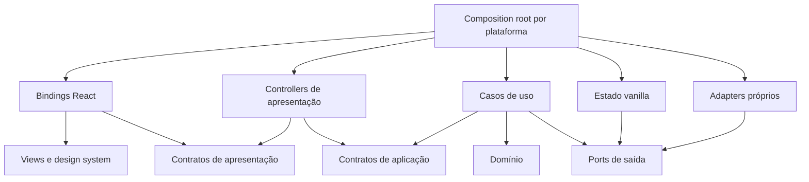

# 02 — Arquitetura proposta

## Fronteira principal

A interface renderiza dados de exibição e emite intenções. Casos de uso aplicam regras, coordenam estado e acionam ports de I/O. Controllers de apresentação transformam os resultados em modelos próprios de cada painel. Nenhuma dessas responsabilidades depende de React para executar.

Os ports atuais continuam como referência para acesso a plataforma. Eles são contratos de saída da aplicação, não o contrato que os componentes novos vão consumir. Um botão de build emite `requestBuild`; não coordena save, compilação, upload e debugger.



As setas mostram conhecimento de dependências; a composição conecta implementações concretas aos contratos.

## Responsabilidades e imports permitidos

| Camada                   | Responsabilidade                                                    | Dependências internas permitidas                           |
| ------------------------ | ------------------------------------------------------------------- | ---------------------------------------------------------- |
| `contracts/application`  | Comandos, resultados e snapshots públicos de aplicação              | Contratos de aplicação; sem frameworks ou implementações   |
| `contracts/presentation` | Modelos de exibição e interfaces de controllers                     | Contratos de apresentação; sem store ou entidades mutáveis |
| `domain`                 | Entidades, invariantes e transformações puras                       | Próprio domínio                                            |
| `application`            | Casos de uso, serviços de coordenação e definição de ports de saída | Domínio e contratos de aplicação                           |
| `state`                  | Estado em memória e transações; implementação dos ports de estado   | Domínio, contratos de aplicação e ports de saída           |
| `presentation`           | Projeções e controllers independentes de UI                         | Contratos de aplicação e apresentação                      |
| `frontend`               | Views e layouts controlados por props                               | Contratos de apresentação, design system e assets visuais  |
| `design-system`          | Primitivas, interação visual, tokens e receitas                     | Próprio design system e assets visuais                     |
| `react-bindings`         | Context estável, lifecycle React e assinaturas de projeções         | Contratos de apresentação e views                          |
| `infrastructure`         | HTTP, IPC, workers e filesystem próprios                            | Domínio, contratos de aplicação e ports de saída           |
| `composition`            | Factories, configuração, lifecycle e conexão das instâncias         | Todas as implementações necessárias à plataforma           |
| `fixtures`               | Implementação simulada dos contratos para o catálogo visual         | Contratos de apresentação                                  |

Bibliotecas externas também precisam de allowlist: React apenas nas camadas de UI, bindings e composição; Zustand apenas em `state`; transporte e APIs nativas em infraestrutura/composição. Bibliotecas puras podem ser admitidas por camada com justificativa. Tipos de bibliotecas de infraestrutura não devem vazar para os contratos públicos.

Imports entre features passam por APIs públicas. Imports de implementação privada, barrels que exponham camadas proibidas e ciclos também são violações. Arquivos não classificados devem falhar no gate, não ser silenciosamente ignorados. Todo import, reexport ou carregamento de implementação de `src/` a partir da aplicação nova é proibido, incluindo aliases, caminhos relativos, imports dinâmicos e assets executáveis. O gate deve verificar também entry points, workers, preload e recursos incluídos no build.

## DI e lifetime

Usar factories explícitas e interfaces pequenas como ponto de partida. Não é necessário um container de DI. A composição cria uma instância por aplicação/janela e uma sessão descartável por projeto; tests criam instâncias isoladas.

O Context React entrega referências estáveis de controllers. Snapshots mutáveis não ficam como valor de um Context global que force atualização de todos os consumidores. Cada painel assina sua própria projeção nos bindings.

`dispose()` remove timers, listeners, workers e subscriptions de uma sessão. A composição é responsável por chamar os disposers e lidar com desmontagem, troca de projeto e reexecução de efeitos em desenvolvimento. Instanciar serviço ou assinar evento no render é proibido.

## Exemplo de contrato de apresentação

Exemplo de design, ainda não compilado nem implementado:

```ts
export type Unsubscribe = () => void

export interface ReadModel<T> {
  getSnapshot(): T
  subscribe(listener: () => void): Unsubscribe
}

export interface ActivityBarModel {
  readonly build: {
    readonly enabled: boolean
    readonly status: 'idle' | 'awaiting-confirmation' | 'running' | 'failed'
    readonly progress: number | null
  }
  readonly saveEnabled: boolean
}

export interface ActivityBarController {
  readonly model: ReadModel<ActivityBarModel>
  requestBuild(): void
  requestSave(): void
}
```

`requestBuild()` registra a intenção e encaminha a execução com tratamento de erro no controller; não deixa uma Promise rejeitada escapar do handler. A aplicação pode usar métodos assíncronos tipados em sua API própria. O modelo de exibição fornece também o estado de confirmação, erro e cancelamento necessário a cada fluxo.

`getSnapshot()` retorna o mesmo objeto enquanto os dados relevantes não mudarem. A projeção deve ser imutável e memoizada. `subscribe()` notifica somente alterações dessa projeção e retorna unsubscribe. Os bindings podem usar `useSyncExternalStore` para conectar esse contrato ao React, sem expor Zustand ao componente. Essa exigência de estabilidade é documentada na [referência oficial do React](https://react.dev/reference/react/useSyncExternalStore).

## Fluxo de build

1. Binding entrega modelo e callbacks à view da barra.
2. Clique, atalho, menu nativo, CLI ou ferramenta de IA chega ao mesmo caso de uso público.
3. Caso de uso verifica permissão, capacidade, projeto/target e concorrência.
4. Coordenador captura ou consolida a revisão correta do documento e decide a persistência necessária.
5. Gates de backplane e de PLC em execução produzem recusa ou confirmação tipada; a UI apenas apresenta a pergunta. Preservar a ordem e os efeitos atuais por teste de caracterização antes de alterá-los.
6. Aplicação delega compilação, upload e runtime aos ports; adapters implementam o transporte.
7. Estado da operação publica progresso e resultado; controller projeta esse estado para o painel.

Confirmação deve carregar identificador da operação e contexto/revisão. Aceitar uma pergunta antiga não autoriza uma operação em outro projeto ou target. A política de revalidação pertence ao caso de uso.

## Organização por feature

Dentro das camadas, organizar módulos por responsabilidade: projetos/documentos, workspace, bibliotecas, targets, build, runtime/debug, import/export, source control, IA e impressão. Evitar um `ApplicationService` ou controller global com todos os métodos.

Centralização significa uma implementação por operação ou regra, com proprietários claros. Não significa concentrar toda a aplicação em uma nova store ou classe gigantesca.

## Custos e alternativas

| Escolha proposta                                  | Benefício                                                                | Custo ou limite                                                                                                                                       |
| ------------------------------------------------- | ------------------------------------------------------------------------ | ----------------------------------------------------------------------------------------------------------------------------------------------------- |
| Controllers e contratos de apresentação separados | Views independentes de estado e casos de uso testáveis sem React         | Mais interfaces e projeções; evitar contratos genéricos sem consumidor                                                                                |
| Zustand vanilla encapsulado                       | Reutiliza conhecimento da equipe sem expor a biblioteca                  | Abstrações precisam preservar assinaturas específicas e estabilidade                                                                                  |
| Factories explícitas                              | Dependências e lifetime visíveis                                         | Composição cresce; dividir factories por sessão/feature antes de considerar container                                                                 |
| Frontend com fixtures antes da lógica             | Permite revisar contratos, aparência e interação cedo                    | Fixture não prova viabilidade funcional; caracterização e primeiro fluxo vertical reduzem esse risco                                                  |
| Espelhamento entre dois repositórios              | Preserva build e distribuição atuais                                     | Ainda duplica arquivos fisicamente e exige gates; pacote comum pode reduzir esse custo futuramente                                                    |
| Aplicação independente sem bridges                | Permite redesign e integração gradual sem depender da arquitetura antiga | Exige portar também bootstrap, recursos e infraestrutura necessários a cada fluxo; features ausentes permanecem indisponíveis até serem implementadas |

Não substituir Zustand, routing, bundlers e distribuição simultaneamente sem evidência de necessidade. Revisitar cada escolha quando protótipos e medições apontarem limites concretos.

## Incorporação gradual do legado sem dependência de runtime

O legado é referência de comportamento, algoritmos e formatos. Para cada funcionalidade, caracterizar o que precisa ser preservado, reimplementar ou portar os trechos necessários para a camada nova, ajustar contratos/dependências e validar a execução independente. Portar código não significa mover cegamente arquivos: cada módulo passa por revisão das fronteiras e das invariantes.

Não existe `infrastructure/legacy`, wrapper que invoque `src/`, compartilhamento de store, fallback para a aplicação antiga ou montagem de uma view nova dentro do produto em produção. Também não usar IPC handlers, workers, serializers ou serviços internos do legado como execução indireta. As implementações necessárias devem pertencer à migração.

Bibliotecas externas, APIs de backend e runtime e formatos de projeto existentes podem ser consumidos por adapters próprios. Compatibilidade de dados e protocolos é distinta de acoplamento à implementação do produto antigo. Fixtures/projetos de teste podem ser copiados para a migração para caracterização, sem importar implementações antigas nos testes novos.

Bootstrap, router quando aplicável, lifecycle, preload/main do Electron quando necessário, workers, assets e packaging têm entrada própria. O produto novo precisa iniciar e executar seus fluxos sem carregar o bootstrap, código ou estado da aplicação antiga.

Novos fluxos são habilitados somente dentro da aplicação de migração. Uma feature ainda ausente aparece como indisponível ou como cenário claramente simulado no catálogo, nunca como sucesso de uma operação real. A produção permanece no produto atual até a avaliação de prontidão e a decisão explícita do time.
